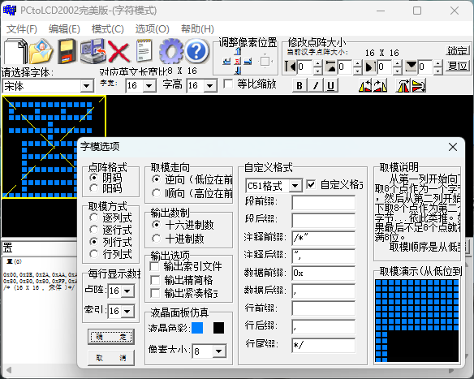
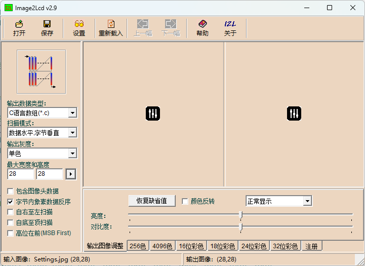

# 0.96寸OLED的LL库Demo
## 说明
  * 本工程由[MrWei95](https://github.com/MrWei95)开源共享
  * 文本编码使用UTF-8
  * 若OLED需要正确显示中文，请确保**OLED_Data.c**的编码为UTF-8！
  * OLED驱动移植自[江协科技](https://jiangxiekeji.com/)，通讯使用硬件IIC。
  * 示例工程由STM32CubeMX生成。
  * 请在编译器中使用```--no-multibyte-chars```，让编译器假定所有的字符常量和字符串字面量都使用单字节字符集，而不会自动转换成多字节字符，有助于避免与 UTF-8 编码混用时出现的错误。示例工程已使用。

## LL库硬件IIC实现
必要的宏定义：
```C
/*IIC 事件*/
/* --EV5 : 起始位已发送...*/
#define  I2C_EVENT_MASTER_MODE_SELECT                      ((uint32_t)0x00030001)  /* BUSY, MSL and SB flag */
/* --EV6 : 发送/接收完成...*/
#define  I2C_EVENT_MASTER_TRANSMITTER_MODE_SELECTED        ((uint32_t)0x00070082)  /* 发送 BUSY, MSL, ADDR, TXE and TRA flags */
#define  I2C_EVENT_MASTER_RECEIVER_MODE_SELECTED           ((uint32_t)0x00030002)  /* 接收 BUSY, MSL and ADDR flags */
/* Master RECEIVER mode -----------------------------*/ 
/* --EV7 */
#define  I2C_EVENT_MASTER_BYTE_RECEIVED                    ((uint32_t)0x00030040)  /* BUSY, MSL and RXNE flags */
/* Master TRANSMITTER mode --------------------------*/
/* --EV8 */
#define I2C_EVENT_MASTER_BYTE_TRANSMITTING                 ((uint32_t)0x00070080) /* TRA, BUSY, MSL, TXE flags */
/* --EV8_2 */
#define  I2C_EVENT_MASTER_BYTE_TRANSMITTED                 ((uint32_t)0x00070084)  /* TRA, BUSY, MSL, TXE and BTF flags */

#define TIMEOUT_MAX 10000  // 超时计数
```
必要的查询总线函数示例：
```C
/**** 
	* 函    数：查询IIC总线事件
	* 参    数：I2Cx：IIC端口
	*			I2C_EVENT：IIC事件
	* 说    明：无
	*/
uint8_t I2C_CheckEvent(I2C_TypeDef* I2Cx, uint32_t I2C_EVENT)
{
	uint32_t lastevent = 0;
	uint32_t flag1 = 0, flag2 = 0;
	uint8_t status = 0;
	
	/* 读取 I2Cx 状态寄存器 */
	flag1 = I2Cx->SR1;
	flag2 = I2Cx->SR2;
	flag2 = flag2 << 16;
	
	/* 从 I2C 状态寄存器获取最后一个事件值 */
	lastevent = (flag1 | flag2) & ((uint32_t)0x00FFFFFF);
	
	/* 检查最后一个事件是否包含 I2C_EVENT */
	if ((lastevent & I2C_EVENT) == I2C_EVENT)
	{
		/* SUCCESS: 最后一个事件等于 I2C_EVENT */
		status = 1;
	}
	else
	{
		/* ERROR: 最后一个事件与 I2C_EVENT 不同 */
		status = 0;
	}
	/* 返回状态status */
	return status;
}
```

## 字符取模示例
### 汉字取模示例


### 图片取模示例

